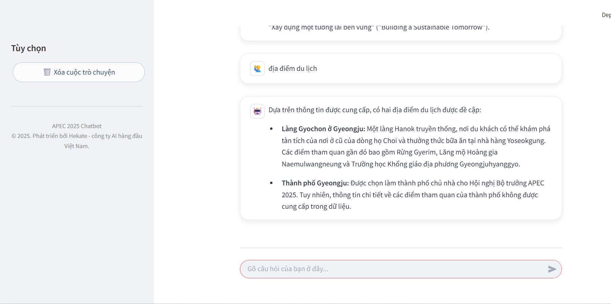

# 🤖 APEC 2025 Chatbot: Trợ lý AI Phục Vụ Hội Nghị APEC

**Chatbot AI đa ngôn ngữ** sử dụng mô hình **Retrieval-Augmented Generation (RAG)**, hỗ trợ người dùng tra cứu thông tin về APEC 2025 một cách **nhanh chóng**, **chính xác** và **thân thiện**.

## 🚀 Công nghệ sử dụng
- **RAG** để tìm kiếm nội dung theo ngữ nghĩa
- **FastAPI** cho Backend API
- **Streamlit** cho giao diện người dùng
- **Qdrant** làm Vector Database
- **Gemini 1.5 Flash** từ Google cho Large Language Model (LLM)
- **Sentence Transformers** cho tạo vector embedding

## 🌟 Tính năng nổi bật

- ✅ **Trả lời thông minh**: Truy xuất ngữ cảnh từ Qdrant và sinh câu trả lời chính xác với LLM Gemini.
- 🌐 **Đa ngôn ngữ**: Tự động nhận diện và phản hồi tiếng Việt hoặc tiếng Anh.
- 💬 **Gợi ý câu hỏi**: Gợi ý nhanh các câu hỏi phổ biến theo chủ đề.
- 📚 **Quản lý tri thức hiệu quả**: Crawl dữ liệu HTML, phân mảnh ("chunk") và lưu trữ có cấu trúc.
- 🖼️ **Giao diện thân thiện**: Streamlit giúp tương tác trực quan, dễ sử dụng đi kèm các quick replies button.

## 📁 Cấu trúc dự án
```
apec_chatbot/
├── backend/
│   ├── data/
│   │   ├── crawled_raw_html/   # Chứa các file HTML thô đã crawl
│   │   └── json_chunks/        # Chứa các chunk dữ liệu đã xử lý (.json)
│   │       └── apec_all_chunks.json
│   ├── app.py                  # API Backend (FastAPI)
│   ├── embedding.py            # Script tạo embedding và tải lên Qdrant
│   ├── data_preparation.py     # Script crawl và tiền xử lý dữ liệu
│   └── .env.example            # Mẫu file cấu hình biến môi trường
├── demo/                       # Chứa ứng dụng Streamlit frontend
│   └── app_streamlit.py        # Giao diện người dùng (Streamlit)
├── requirements.txt            # Danh sách các thư viện Python cần thiết
└── README.md                   # File mô tả dự án này
```
## ⚙️ Cài đặt

### 1. Cài thư viện

```bash
pip install -r requirements.txt
````

### 2. Cấu hình biến môi trường

Tạo file `.env` nằm bằng folder backend và demo dựa theo `.env.example`:

```env
QDRANT_CLOUD_URL="https://YOUR_CLUSTER_URL:6333"
QDRANT_API_KEY="YOUR_QDRANT_API_KEY"
QDRANT_COLLECTION_NAME="apec_chatbot_data"
GOOGLE_API_KEY="YOUR_GOOGLE_GEMINI_API_KEY"
LLM_MODEL_NAME="gemini-1.5-flash"
EMBEDDING_MODEL_NAME="all-MiniLM-L6-v2"
```

---

## 🛠️ Chạy thử demo

### Bước 1: Crawl và xử lý dữ liệu (đã crawl và nằm trong data)

```bash
python backend/data_preparation.py
```

### Bước 2: Tạo embedding và tải lên Qdrant (có thể up lại vẫn được vì trong code có lệnh xóa collection)

```bash
python backend/embedding.py
```

### Bước 3: Khởi động backend FastAPI

```bash
cd apec_chatbot
cd backend
uvicorn app:app --host 0.0.0.0 --port 8000 --reload
```
Có chữ Application startup complete là tiếp tục.
### Bước 4: Khởi động giao diện Streamlit

```bash
cd apec_chatbot
cd demo
streamlit run app_streamlit.py
```

Truy cập: [http://localhost:8501](http://localhost:8501)

---

## 💬 Ví dụ tương tác

| Người dùng               | Chatbot phản hồi                                    |
| ------------------------ | --------------------------------------------------- |
| APEC 2025 tổ chức ở đâu? | APEC 2025 sẽ được tổ chức tại Hàn Quốc...           |
| What is APEC?            | APEC is a regional economic forum...                |
| Du lịch  | Làng Gyochon ở Gyeongju: Một làng Hanok truyền thống, nơi du khách... |
| Giá vé máy bay?          | Tôi xin lỗi, tôi không tìm thấy thông tin cụ thể... |

---
## Kết quả ChatBot

[](https://github.com/phancongtam190305/apec_chatbot/blob/main/back_ground_img/Screenshot%202025-07-26%20211508.png)

---

## 📜 Giấy phép

MIT License © 2025 – Dự án chatbot AI phục vụ APEC bởi Phan Công Tâm.


